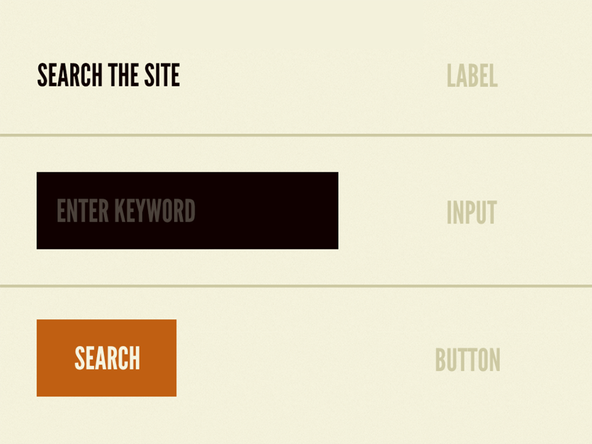
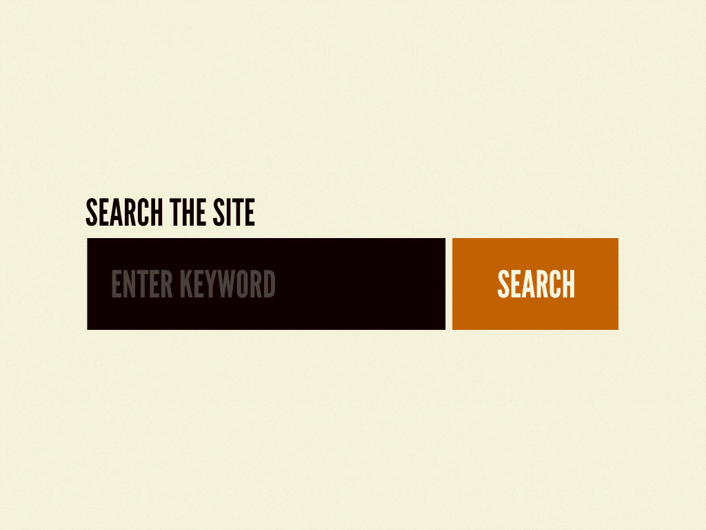

# Advanced React for Enterprise: React for Senior Engineers

## Introduction to design systems

### Atomic Design principles

#### Atomic Design Methodology

- Atoms, molecules, organisms, templates, and pages

**The atomic design methodology:**

Atomic design is a methodology composed of five distinct stages working together to create interface design systems in a more deliberate and heirarchical manner. The five stages of atomic design are:

1. Atoms
2. Molecules
3. Organisms
4. Templates
5. Pages

Atomic design is not a linear process, nut rather a mental model to help us think of our user interfaces as both a cohesive whole and a collection of parts at the same time.

##### Atoms

If atoms are the basic building blocks of matter, then the atomcs of our interfaces serve as the foundational building blocks that comprise all our user interfaces. These atoms include basic HTML elements like form labels, inputs, buttons, and others that can't be broken down any further without ceasing to be functional.

Each interface atom has its own unique properties, such as the dimensions of a hero propertues influence how each atom should be applied to the broader user interface system.

##### Molecules

In interfaces, molecules are relatively simple groups of UI elements functioning together as a unit. For example, a form label, search input, and button can join together to create a search form molecule.

When combined, these abstract atoms suddenly have purpose. The label atom now defines the input atom.

##### Organisms

Organisms are relatively complex UI components composed of groups of molecules and/or atoms and and/or other organisms. These organisms form distinct sections of an interface.

The header forms a standalone section of an interface, even though it contains several smaller pieces of interface with their own unique properties and functionality.

##### Templates

Templates are page-level objects that place components into a layout and articlate the design's underlying content structure.

This homepage template displays all the necessary page components functioning together, which provides context for these relatively abstract molecules and organisms.

Another important characteristic of templates is that they focus on the page’s underlying content structure rather than the page’s final content.

##### Pages

Pages are specific instances of templates that show what a UI looks like with real representative content in place.

We must create systems that establish reusable design patterns and also accurately reflect the reality of the content we're putting inside of those patterns.

Pages also provide a place to articulate variations in templates, which is crucial for establishing robust and reliant design systems. Here are just a few examples of template variations:

- A user has one item in their shopping cart and another user has ten items in their cart.
- A web app's dashboard typically shows recent activity, but that section id suppressed for first-time users.
- One article headline might be 40 characters long while another headline might be 340 characters long.
- Users with administrative privileges might see additional buttons and options on their dashboard compared to users who aren't admins.

So, that's atomic design! These five distinct stages concurrently work together to produce effectlive user interface design systems. To sum up atomic design in a nutshell:

- *Atoms* are UI elements that can't be broken down any further and serve as the elemental building blocks of an interface.
- *Molecules* are collections of atoms that form relatively simple UI components.
- *Organisms* are relatively complex components that form discrete sections of an interface.
- *Templates* place components within a layout and demonstrate the design's underlying content structure.
- *Pages* apply real content to templates and articulate variations to demonstrate the final UI and test the resilience of the design system.

#### Advantages of atomic design

1. **The psrt and the whole**

    One of the biggest advantages atomic design provides is the ability to quickly shift between abstract and concrete. We can simultaneously see our interfaces broken down to their atomic elements and also see how those elements combine together to form our final experiences.

2. **Clean separation between structure and content**

    A well-crafted design system caters to the content that lives inside it, and well-crafted content is aware og how it's presented in the context of UI.

## CSS Architecture

### CSS Architecture checklist

1. Organised - fixed code structure
2. No specificity issues
3. Atomic design principles
4. Easy to understand (comments, variables)
5. Fully customizable / themable
6. Reusable across teams / projects
